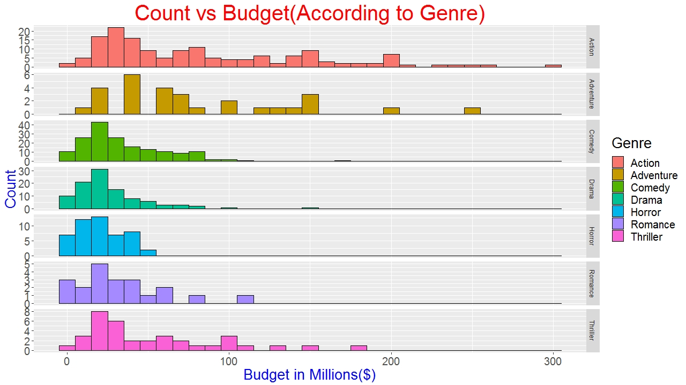
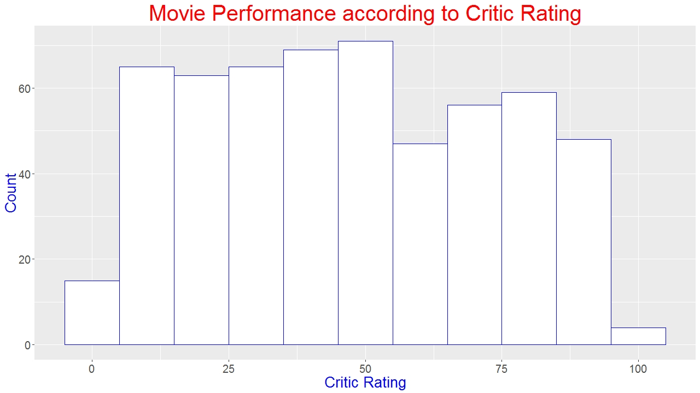

# Movie Analysis

## Business Problem

### The dataset contains information for movies released through 2007 to 2011. 
### The problem was to derive insights for this dataset.

## Plots

### Plot 1: Audience vs Critic Rating (According to Year and Genre)

### Plot 2: Scatter plot for Audience vs Critic Rating 

### Plot 3: Count vs Budget (According to Genre)

### Plot 4: Movie Performance according to Audience Rating

### Plot 5: Movie Performance according to Critic Rating

### Plot 6: BoxPlot for Audience Rating vs Critic Rating

 

